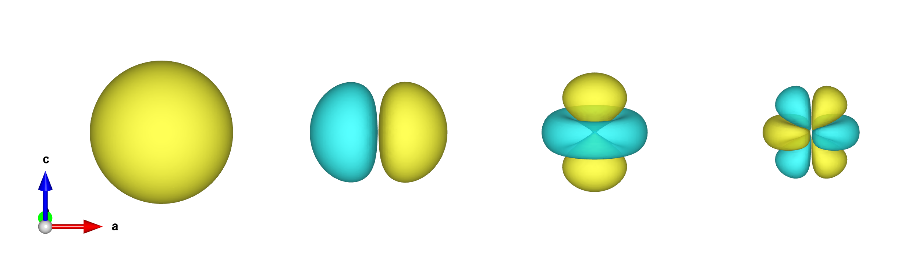
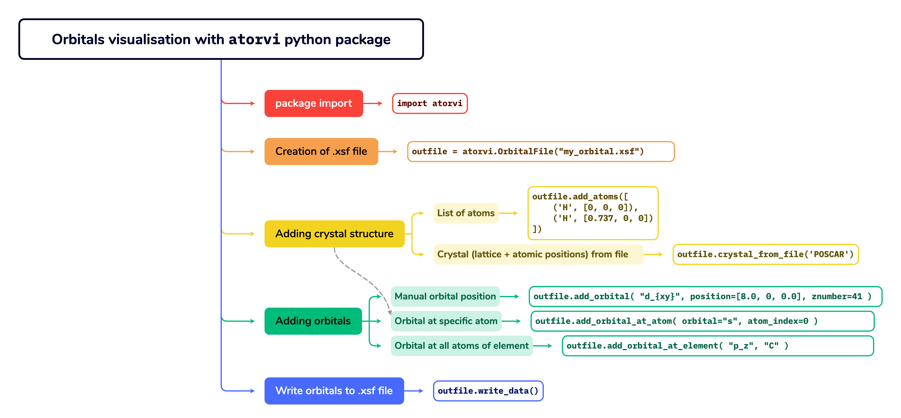

---
title: "atorvi user manual"
author: [Dmitry Korotin]
listings-no-page-break: true
disable-header-and-footer: true
titlepage: false
colorlinks: true
listings-disable-line-numbers: true
...


# User manual for atorvi - ATomic ORbitals VIzualization package



## Table of contents
- [Introduction](#introduction)
- [Minimal theory: Atomic orbitals](#minimal-theory-atomic-orbitals)
- [Installation](#installation)
- [Workflow](#workflow)
  - [Step 0: Import the package](#step-0-import-the-package)
  - [Step 1: Create the output file in XCrysDen format](#step-1-create-the-output-file-in-xcrysden-format)
  - [Step 2: Add atoms to the file](#step-2-add-atoms-to-the-file)
      - [2.1. Manual atoms addition](#21-manual-atoms-addition)
      - [2.2. Reading atoms from a file](#22-reading-atoms-from-a-file)
  - [Step 3: Add orbitals to the file](#step-3-add-orbitals-to-the-file)
      - [3.1. Orbitals at arbitrary positions](#31-orbitals-at-arbitrary-positions)
      - [3.2. Orbitals at atoms positions](#32-orbitals-at-atoms-positions)
      - [3.3. Orbitals at all atoms of the same element](#33-orbitals-at-all-atoms-of-the-same-element)
      - [3.4. Mixing (or hybridization) of atomic orbitals](#34-mixing-or-hybridization-of-atomic-orbitals)
  - [Step 4: Write the file](#step-4-write-the-file)
- [Important notes](#important-notes)
- [Author](#author)


## Introduction

`atorvi` is a Python package for creating three-dimensional visualizations of atomic orbitals in crystalline materials. These visualizations can be used in research publications, educational materials, and scientific analysis.

Common applications in condensed matter physics and solid-state chemistry include:

1. **Magnetic Ordering**: Visualize orbital overlap between magnetic atoms in ferromagnetic and antiferromagnetic materials to understand exchange interactions between neighboring sites.

2. **Chemical Bonding**: Examine hybrid orbitals (sp², sp³) in semiconductors and insulators to understand covalent bonding and electron sharing between atoms.

3. **Electronic Correlations**: Study electron localization in strongly correlated systems like Mott insulators, complementing computational results from DFT+U and DMFT calculations.

4. **Band Structure Analysis**: Map the orbital contributions to electronic bands when analyzing band structures and density of states (DOS).

5. **Crystal Field Theory**: Explore how crystal fields affect d-orbital splitting in transition metal compounds, helping explain their electronic, magnetic and optical behavior.

The package generates files in XCrysDen format, enabling both interactive exploration and high-resolution image export.


## Minimal theory: Atomic orbitals

The atomic orbital of the [hydrogen-like atom](https://en.wikipedia.org/wiki/Hydrogen-like_atom) with quantum numbers $n$ and $\ell$ is calculated as:
$$
\psi_{n \ell}(\mathbf{r}) = R_{n \ell}(r) X_{\ell c}(\mathbf{r}),
 $$
 where $X_{\ell c}$ are the [cubic harmonics](https://en.wikipedia.org/wiki/Cubic_harmonic).

The radial part of the atomic orbital is calculated as:
$$
 R_{n \ell} (r) = \sqrt {{\left ( \frac{2 Z}{n a_0} \right ) }^3\frac{(n-\ell-1)!}{2n{(n+\ell)!}} } e^{- Z r / {n a_0}} \left ( \frac{2 Z r}{n a_0} \right )^{\ell} L_{n-\ell-1}^{(2\ell+1)} \left ( \frac{2 Z r}{n a_0} \right ) ,
 $$
where:
$L_{n-\ell-1}^{(2 \ell+1)}$ – are the [generalized Laguerre polynomials](https://en.wikipedia.org/wiki/Laguerre_polynomials#Generalized_Laguerre_polynomials), $a_0$ is the Bohr radius and $Z$ is the screened nuclear charge.
We use the effective nuclear charge by [Clementi *et al.*](https://doi.org/10.1063%2F1.1733573) to account the shielding effect of inner-shell electrons on outer-shell electrons, providing a more accurate representation of the potential energy experienced by electrons in multi-electron atoms during calculations.

`atorvi` always generates orbitals of the outermost shell for a given element.

## Installation

To install **atorvi**, you can use `pip`:

```bash
pip install atorvi
```

## Workflow


### Step 0: Import the package
In your python script or Jupyter notebook write
```python
import atorvi
```
After the import, several useful objects are available for you, such as 
```python
atorvi.supported_orbitals, 
atorvi.p_orbitals, 
atorvi.d_orbitals, 
atorvi.f_orbitals
```

### Step 1: Create the output file in XCrysDen format
Create an instance of the `OrbitalFile` class, which will be used to write the `.xsf` file.
```python
outfile = atorvi.OrbitalFile("my_orbital.xsf")
```

### Step 2: Add atoms to the file
**This step is optional. You can generate orbitals without adding atoms to the file.**

You can add atoms to the file manually creating a non-periodic molecule, or you can read crystal structure from a (XSF/POSCAR/CIF) file.

#### 2.1. Manual atoms addition
`.add_atoms()` method accepts a list of tuples, where each tuple contains the atomic symbol and the coordinates of the atom. You can add atoms one-by-one or in a batch. Atomic coordinates are given in angstroms.
```python
outfile.add_atoms([
    ('H', [0, 0, 0]),
    ('H', [0.737, 0, 0])
])
```

#### 2.2. Reading atoms from a file
`.crystal_from_file()` method accepts a path to the file with crystal structure. We use [pymatgen](https://pymatgen.org/) to read the file, so this package should be installed in your environment with `pip install pymatgen` to use this method. Supported file formats are the same that pymatgen supports.
```python
structure = outfile.crystal_from_file('./KCuF3_structure.xsf')
```
this method returns a `pymatgen.core.structure.Structure` object, which can be used to further manipulate the crystal structure in your script if necessary.

See example of reading structure from file in [examples/structure_from_file/](../examples/structure_from_file/)

### Step 3: Add orbitals to the file

You can add to the file the following orbitals:
```python
print(atorvi.supported_orbitals)

['s', 
'p_z', 'p_x', 'p_y', 
'd_{3z^2-r^2}', 'd_{xz}', 'd_{yz}', 'd_{xy}', 'd_{x^2-y^2}', 
'f_{z^3}', 'f_{xz^2}', 'f_{yz^2}', 'f_{xyz}', 'f_{z(x^2-y^2)}', 
'f_{x(x^2-3y^2)}', 'f_{y(3x^2-y^2)}']
```

#### 3.1. Orbitals at arbitrary positions
You can add an orbital at the arbitrary position using `.add_orbital(orbital, position, znumber, coeff)` method. This method accepts the following arguments:
```python
"""
orbital : str
    The type of orbital (e.g., "s", "p_x", "d_{xy}", etc.).
position : list, optional
    The position of the orbital in angstroms (default is [0.0, 0.0, 0]).
znumber : int, optional
    The atomic number of the element (default is 8 i.e. Oxygen).
coeff : float, optional
    The coefficient of the orbital (default is 1.0).
"""
```
Example:
```python
outfile.add_orbital("d_{3z^2-r^2}", position=[0, 0, 0], znumber=41)
```

See also [examples/d_orbitals/](../examples/d_orbitals/) and [examples/f_orbitals/](../examples/f_orbitals/) for more examples.

#### 3.2. Orbitals at atoms positions
If you have created some atoms at the Step 2, you can add an orbital at the position of the *i*-th atom using `.add_orbital_at_atom(orbital, atom_index, coeff)` method. This method accepts the following arguments:
```python
"""
orbital : str
    The type of orbital (e.g., "s", "p_x", "d_{xy}", etc.).
atom_index : int
    The index of the atom in the system.
coeff : float, optional
    The coefficient of the orbital (default is 1.0).
"""

```
Example:
```python
atoms = [
    ('Cu', [0.0,0.0,0.0]),
    ('Cu', [2.0,0.0,0.0]),
    ]

outfile.add_atoms(atoms)

outfile.add_orbital_at_atom('d_{xz}', 0)
outfile.add_orbital_at_atom('d_{yz}', 1)
```

See also [examples/orbital_ordering](../examples/orbital_ordering/) for more examples.

#### 3.3. Orbitals at all atoms of the same element
You can add an orbital at all atoms of the same element using `.add_orbital_at_element(orbital, element, coeff)` method. This method accepts the following arguments:
```python
"""
orbital : str
    The type of orbital (e.g., "s", "p_x", "d_{xy}", etc.).
element : str
    The symbol of the element.
coeff : float, optional
    The coefficient of the orbital (default is 1.0).
"""
```
Example:

```python
outfile.add_orbital_at_element("p_z", "C")
```

See also [examples/orbital_ordering/](../examples/orbital_ordering/) for more examples.

#### 3.4. Mixing (or hybridization) of atomic orbitals
You can get hybridized (sp² or sp³ or *etc*) orbitals combining the atomic orbitals with specific coefficients using the `coeff` parameter of the `.add_orbital*` methods. For example, the sp³ hybridized orbital is: $\frac{1}{2}s + \frac{1}{2}p_x + \frac{1}{2}p_y + \frac{1}{2}p_z$.

One can get this with:
```python
outfile.add_atoms([("C", [0, 0, 0])])

outfile.add_orbital_at_atom("s", 0, coeff=0.5)
outfile.add_orbital_at_atom("p_x", 0, coeff=0.5)
outfile.add_orbital_at_atom("p_y", 0, coeff=0.5)
outfile.add_orbital_at_atom("p_z", 0, coeff=0.5)
```

See [examples/sp3_hybridization/](../examples/sp3_hybridization/) for more examples.

Using the same `coeff` parameter, you can also get molecular bonding and antibonding orbitals. For example, the antibonding molecular orbital of hydrogen molecule is: $\varphi_{ABO} = \frac{1}{\sqrt{2}} s_A - \frac{1}{\sqrt{2}} s_B$:

```python
outfile.add_atoms([
    ('H', [0, 0, 0]),
    ('H', [0.737, 0, 0])
])

outfile.add_orbital_at_atom('s', 0, coeff =   0.707)
outfile.add_orbital_at_atom('s', 1, coeff = - 0.707)
```

See also [examples/H2_molecule/](../examples/H2_molecule/).

### Step 4: Write the file
Just call `.write_data()` method to write the .xsf file with the structure and the orbitals. There is optional parameter `squared=False` for this function. If `squared=True`, the value of the orbital is squared. This is useful for visualizing the density of the orbital.

Example:
```python
outfile.write_data()
```

## Important notes
- These are atomic orbitals of a hydrogen-like atom. Their radial part is more or less close to the radial part of multi-electron atom, thanks to the screened nuclear charge we use. 
But in molecules or solid state the radial part could differ a lot. Therefore, use obtained pictures with caution only for qualitative description and illustrations.
- It is a good idea to vary the isosurface value in your plotting software to get the best picture of orbitals.
- The 3D data generated by `atorvi` uses the regular cubic mesh with the 0.05 Å grid spacing by default. You can tune this parameter at the very first step with `grid_step=0.05` parameter of the `OrbitalFile` class:

    ```python
    outfile = atorvi.OrbitalFile("my_orbital.xsf", grid_step=0.1)
    ```
    A smaller `grid_step` will give you a more smooth picture, but will also increase the size of the output file. And vice versa.

## Author

`atorvi` is developed and maintained by [Dmitry Korotin](https://www.researchgate.net/profile/Dmitry-Korotin). Contributions, suggestions, and feedback are welcome to help improve the project.